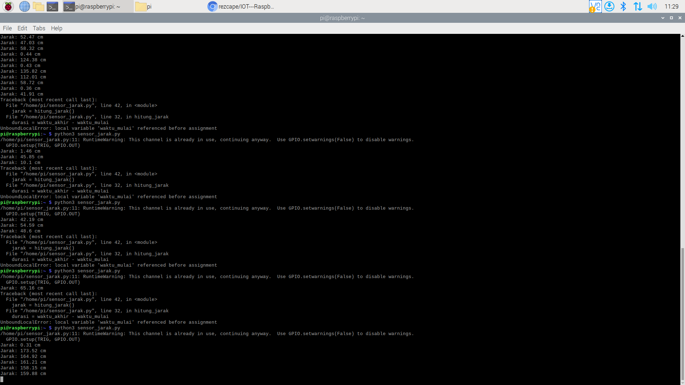

# raspberry-distance-project

Nama | NRP
--- | ---
Evan Christian Nainggolan | 5027241026
Ahmad Syauqi Reza | 5027241085

# Penjelasan Raspberry Pi dalam Sistem IoT
## Apa itu Raspberry Pi?
Raspberry Pi adalah komputer papan tunggal (Single-Board Computer - SBC) seukuran kartu kredit yang dikembangkan di Inggris. Meskipun ukurannya kecil, Raspberry Pi memiliki semua komponen dasar komputer seperti CPU, RAM, port USB, HDMI, dan yang terpenting, pin GPIO (General-Purpose Input/Output). Pin inilah yang membuatnya sangat populer untuk proyek elektronik, robotika, dan Internet of Things (IoT).

## Konsep Dasar Raspberry Pi:
- **Sistem Operasi (OS)**: Biasanya menjalankan Raspberry Pi OS (sebelumnya dikenal sebagai Raspbian), sebuah turunan dari Linux Debian yang dioptimalkan untuk perangkat kerasnya.
- **GPIO Pins**: Pin fisik yang memungkinkan Raspberry Pi berkomunikasi langsung dengan komponen elektronik lain seperti sensor, motor, dan lampu LED. Ini adalah jembatan antara dunia software (kode) dan dunia hardware (fisik).
- **Fleksibilitas**: Dapat berfungsi sebagai desktop mini, server media, pusat kontrol rumah pintar, atau otak dari sebuah robot.
- **Bahasa Pemrograman**: Sangat mendukung Python, yang menjadikannya ramah bagi pemula karena sintaksnya yang mudah dibaca.

## Cara Kerja dalam Proyek Ini
Raspberry Pi bertindak sebagai unit pemrosesan utama. Ia menjalankan skrip Python yang menginstruksikan pin GPIO untuk mengirim sinyal ke sensor ultrasonik dan menerima kembali sinyal pantulannya untuk menghitung jarak.

### Keuntungan
- **Kekuatan Pemrosesan**: Jauh lebih kuat daripada mikrokontroler seperti Arduino atau ESP32, mampu menjalankan OS lengkap dan tugas-tugas komputasi yang kompleks.
- **Konektivitas Lengkap**: Dilengkapi dengan WiFi, Bluetooth, Ethernet, dan port USB bawaan.
- **Komunitas Besar**: Memiliki dukungan komunitas online yang sangat besar, tutorial, dan pustaka kode yang melimpah.

### Analogi
Bayangkan Raspberry Pi adalah otak mini dari sebuah robot. Ia dapat melihat melalui "mata" (kamera), mendengar melalui "telinga" (mikrofon), merasakan melalui "kulit" (sensor), dan menggerakkan "tangan" (motor), semuanya dikendalikan oleh program yang Anda tulis.
---

# Langkah Demi Langkah Menjalankan Sensor Jarak di Raspberry Pi
## Persiapan Awal
**Hardware yang Diperlukan:**
- Raspberry Pi (model apa pun dengan pin GPIO)
- Sensor Jarak Ultrasonik HC-SR04
- Breadboard
- Kabel Jumper (male-to-female atau male-to-male sesuai kebutuhan)
**Software yang Diperlukan**:
- Raspberry Pi OS - sudah terinstall di SD Card.
- Python 3 - biasanya sudah terinstall secara default di Raspberry Pi OS.

# Langkah 1: Merangkai Komponen
Hubungkan sensor HC-SR04 ke pin GPIO Raspberry Pi seperti pada skema di bawah. Pastikan Raspberry Pi dalam keadaan mati saat merangkai.
| Sensor HC-SR04 Pin |	Raspberry Pi Pin | Keterangan |
| VCC	| Pin 2 (5V Power)	| Sumber daya untuk sensor |
| GND	| Pin 6 (Ground)	| Ground |
| TRIG	| Pin 16 (GPIO 23)	| Pin untuk mengirim sinyal ultrasonik |
| ECHO	| Pin 18 (GPIO 24)	| Pin untuk menerima sinyal pantulan | 

# Langkah 2: Membuat File Python
1. Buka Terminal di Raspberry Pi Anda.
2. Buat file Python baru menggunakan editor nano dengan mengetik perintah:
```Bash
nano sensor_jarak.py
``` 
3. Salin dan tempel kode Python yang telah Anda buat ke dalam editor nano.
4. Simpan file dengan menekan Ctrl + X, lalu Y, dan Enter.

# Langkah 3: Menjalankan Kode
1. Masih di Terminal, jalankan skrip yang baru saja Anda buat dengan perintah:
```Bash
python3 sensor_jarak.py
```
2. Pastikan tidak ada pesan error yang muncul.

# Langkah 4: Verifikasi Output
1. Arahkan sensor ke sebuah objek.
2. Lihat pada jendela Terminal, Anda akan melihat output jarak yang diukur secara real-time, diperbarui setiap detik.
```
Jarak: ... cm
Jarak: ... cm
Jarak: ... cm
```

# Langkah 5: Menghentikan Program
1. Untuk menghentikan eksekusi skrip, tekan Ctrl + C di Terminal.
2. Akan muncul pesan "Menghentikan program", yang menandakan skrip telah berhenti dengan aman dan pin GPIO telah dibersihkan.

# Monitoring Jarak dengan Raspberry Pi dan Sensor Ultrasonik HC-SR04
Proyek ini mendemonstrasikan cara menggunakan Raspberry Pi dan sensor ultrasonik HC-SR04 untuk mengukur jarak ke sebuah objek. Skrip Python digunakan untuk mengendalikan pin GPIO, memicu sensor, dan menghitung jarak berdasarkan waktu pantulan gelombang suara.

# Fitur Utama
- Mengukur jarak secara akurat menggunakan sensor HC-SR04.
- Menggunakan pin GPIO Raspberry Pi untuk interfacing hardware.
- Ditulis dalam bahasa Python 3, memanfaatkan library RPi.GPIO.
- Menampilkan hasil pengukuran real-time di terminal.
- Penanganan interupsi keyboard (Ctrl+C) untuk menghentikan program dengan aman.

# Skema Rangkaian
| HC-SR04 Pin |	Raspberry Pi Pin (BCM) |
| VCC |	5V |
| GND |	GND |
| TRIG |	GPIO 23 |
| ECHO |	GPIO 24 |


# Penjelasan Kode
Berikut adalah penjelasan kode yang ada di file sensor_jarak.py.
## 1. Impor Library
```Python
import RPi.GPIO as GPIO
import time
```
- RPi.GPIO: Library utama untuk mengontrol pin GPIO pada Raspberry Pi.
- time: Library standar Python untuk fungsi terkait waktu, seperti time.sleep() untuk memberi jeda dan time.time() untuk mengukur waktu.

## 2. Pengaturan GPIO
``` Python
GPIO.setmode(GPIO.BCM)

TRIG = 23
ECHO = 24

GPIO.setup(TRIG, GPIO.OUT)
GPIO.setup(ECHO, GPIO.IN)
```
- GPIO.setmode(GPIO.BCM): Mengatur mode penomoran pin berdasarkan nomor "Broadcom SOC channel", yang sesuai dengan nomor GPIO (misal: GPIO23, GPIO24). Ini adalah standar yang umum digunakan.
- TRIG = 23 dan ECHO = 24: Mendefinisikan variabel untuk menyimpan nomor pin yang digunakan agar kode lebih mudah dibaca.
- GPIO.setup(...): Mengkonfigurasi setiap pin. TRIG sebagai OUT (output) karena Raspberry Pi akan mengirim sinyal dari pin ini. ECHO sebagai IN (input) karena akan menerima sinyal.

## 3. Fungsi hitung_jarak()
``` Python
def hitung_jarak():
    GPIO.output(TRIG, True)
    time.sleep(0.00001)
    GPIO.output(TRIG, False)

    while GPIO.input(ECHO) == 0:
        waktu_mulai = time.time()

    while GPIO.input(ECHO) == 1:
        waktu_akhir = time.time()

    durasi = waktu_akhir - waktu_mulai
    jarak = durasi * 17150
    jarak = round(jarak, 2)
    return jarak
```
- Fungsi ini berisi logika utama untuk mengukur jarak.
- Mengirim Pulsa: Pin TRIG diberi sinyal HIGH (True) selama 10 mikrodetik, lalu LOW (False). Ini memicu sensor untuk mengirimkan semburan gelombang ultrasonik.
- Menangkap Waktu: Loop while pertama menunggu sampai pin ECHO menjadi HIGH, menandakan gelombang pantulan telah diterima, Waktu saat itu dicatat sebagai waktu_mulai. Loop kedua menunggu sampai ECHO kembali LOW, dan waktunya dicatat sebagai waktu_akhir.
- Kalkulasi Jarak: durasi adalah selisih waktu antara waktu_akhir dan waktu_mulai. Jarak dihitung dengan rumus: Jarak = (Durasi * Kecepatan Suara) / 2. Angka 17150 adalah penyederhanaan dari 34300 cm/s / 2 untuk langsung mendapatkan jarak dalam sentimeter.
- round(jarak, 2) membulatkan hasil menjadi dua angka desimal.

## 4. Loop Utama dan Penanganan Error
```Python
try:
    while True:
        jarak = hitung_jarak()
        print(f"Jarak: {jarak} cm")
        time.sleep(1)

except KeyboardInterrupt:
    print("Menghentikan program")
    GPIO.cleanup()
```
- try...except: Struktur ini digunakan untuk menangani error dengan baik.
- while True:: Membuat loop tak terbatas yang akan terus menerus memanggil fungsi hitung_jarak() dan mencetak hasilnya.
- time.sleep(1): Memberi jeda 1 detik antar pengukuran agar tidak membebani CPU dan outputnya mudah dibaca.
- except KeyboardInterrupt:: Blok ini akan dieksekusi ketika pengguna menekan Ctrl + C. Ini adalah cara yang bersih untuk keluar dari loop.
- GPIO.cleanup(): Perintah yang sangat penting. Ini mereset status semua pin GPIO yang telah digunakan oleh skrip, mencegah masalah pada eksekusi skrip berikutnya.

## Output

